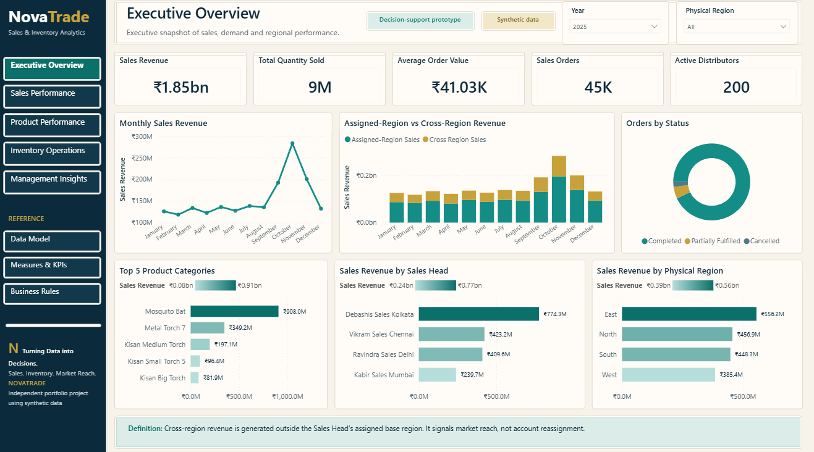

# Shamsh Tabrez Shaikh - Data & BI Portfolio

Source code for my professional portfolio as a Data Analyst and Power BI Developer in Ontario, Canada.

[View the live portfolio](https://shamsh-tabrez-portfolio.shaikhtabrez56.chatgpt.site) | [Explore NovaTrade](https://novatrade-analytics.shaikhtabrez56.chatgpt.site) | [NovaTrade repository](https://github.com/tabrez-source/NovaTrade-Sales-Inventory-Analytics)



## About the portfolio

The site presents my technical training, operational background, and independently built Data & BI project evidence. Its featured case study is NovaTrade Sales & Inventory Analytics v1.0.0, an end-to-end SQL Server and Power BI portfolio project using synthetic business data.

The content deliberately separates portfolio work from employment experience and does not present NovaTrade as employer work.

## Highlights

- Responsive, recruiter-focused single-page experience
- Sticky navigation with active-section feedback
- SEO metadata, canonical URL, sitemap, robots rules, Open Graph data, and structured profile data
- Accessible navigation, skip link, descriptive image text, and keyboard-friendly links
- Seven approved NovaTrade report images and a downloadable Data & BI resume
- Direct links to LinkedIn, GitHub, the NovaTrade showcase, repository, and v1.0.0 release

## Technology

- Next.js 16 and React 19
- TypeScript
- Vinext and Vite
- Cloudflare Worker-compatible output
- Plain CSS for the visual system and responsive layout
- Node test runner for rendered HTML and SEO checks

## Run locally

Prerequisites: Node.js 22.13 or newer, npm, Linux or WSL, `curl`, `flock`, and GNU `timeout`.

```bash
npm ci
npm run dev
```

Quality checks:

```bash
npm run lint
npm test
```

## Project structure

```text
app/                 Portfolio page, styling, metadata, sitemap, and robots rules
public/novatrade/    Approved Power BI report evidence
public/resume/       Current Data & BI resume
tests/               Rendered HTML, recruiter-content, and SEO checks
worker/              Worker entry point
scripts/             Reproducible build and artifact validation
```

## Hosting

The live website is hosted through ChatGPT Sites. This GitHub repository is the public, maintainable source snapshot and is not an automatic deployment trigger.

## Privacy and data note

NovaTrade is an independent portfolio case study built with synthetic data. The repository contains no employer-confidential data, production credentials, or residential street address.

## Contact

- [LinkedIn](https://www.linkedin.com/in/shamsh-tabrez-shaikh-7652ba176)
- [GitHub](https://github.com/tabrez-source)
- [Email](mailto:shaikhtabrez56@gmail.com)
